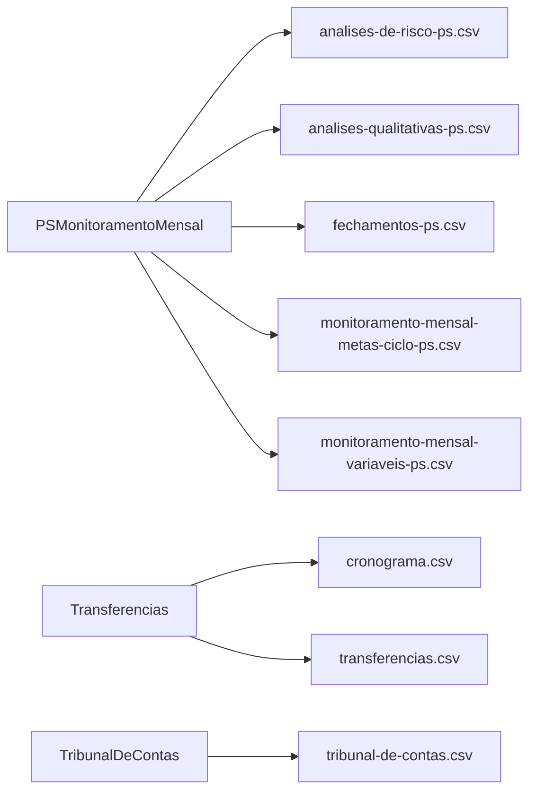

# Colunas dos relatórios

<!-- Gerado por bin/report-columns-gen.ts — não edite à mão. -->

8 arquivos de relatório com schema de colunas declarado.

## Arquivos

| Arquivo | Fontes | Colunas | Doc |
| --- | --- | --- | --- |
| `analises-de-risco-ps.csv` | `PSMonitoramentoMensal` | 11 | [detalhes](./report-columns/analises-de-risco-ps-csv.md) |
| `analises-qualitativas-ps.csv` | `PSMonitoramentoMensal` | 9 | [detalhes](./report-columns/analises-qualitativas-ps-csv.md) |
| `cronograma.csv` | `Transferencias` | 7 | [detalhes](./report-columns/cronograma-csv.md) |
| `fechamentos-ps.csv` | `PSMonitoramentoMensal` | 8 | [detalhes](./report-columns/fechamentos-ps-csv.md) |
| `monitoramento-mensal-metas-ciclo-ps.csv` | `PSMonitoramentoMensal` | 7 | [detalhes](./report-columns/monitoramento-mensal-metas-ciclo-ps-csv.md) |
| `monitoramento-mensal-variaveis-ps.csv` | `PSMonitoramentoMensal` | 23 | [detalhes](./report-columns/monitoramento-mensal-variaveis-ps-csv.md) |
| `transferencias.csv` | `Transferencias` | 68 | [detalhes](./report-columns/transferencias-csv.md) |
| `tribunal-de-contas.csv` | `TribunalDeContas` | 13 | [detalhes](./report-columns/tribunal-de-contas-csv.md) |

## Fontes por arquivo

