# Colunas dos relatórios

<!-- Gerado por bin/report-columns-gen.ts — não edite à mão. -->

38 arquivos de relatório com schema de colunas declarado.

## Arquivos

| Arquivo | Fontes | Colunas | Doc |
| --- | --- | --- | --- |
| `acompanhamentos.csv` | `Obras`, `Projeto`, `Projetos` | 24 | [detalhes](./report-columns/acompanhamentos-csv.md) |
| `aditivos.csv` | `Obras`, `Projeto`, `Projetos` | 12 | [detalhes](./report-columns/aditivos-csv.md) |
| `analises-de-risco-ps.csv` | `PSMonitoramentoMensal` | 11 | [detalhes](./report-columns/analises-de-risco-ps-csv.md) |
| `analises-qualitativas-ps.csv` | `PSMonitoramentoMensal` | 9 | [detalhes](./report-columns/analises-qualitativas-ps-csv.md) |
| `arquivos.csv` | `Obras`, `Projeto`, `Projetos` | 16 | [detalhes](./report-columns/arquivos-csv.md) |
| `atividades-pendentes.csv` | `AtvPendentes` | 9 | [detalhes](./report-columns/atividades-pendentes-csv.md) |
| `contratos.csv` | `Obras`, `Projeto`, `Projetos` | 35 | [detalhes](./report-columns/contratos-csv.md) |
| `cronograma.csv` | `Obras`, `Projeto`, `Projetos`, `Transferencias` | 26 | [detalhes](./report-columns/cronograma-csv.md) |
| `demandas.csv` | `Demandas` | 18 | [detalhes](./report-columns/demandas-csv.md) |
| `detalhes-do-projeto.csv` | `Projeto` | 62 | [detalhes](./report-columns/detalhes-do-projeto-csv.md) |
| `encaminhamentos.csv` | `Projeto` | 6 | [detalhes](./report-columns/encaminhamentos-csv.md) |
| `enderecos.csv` | `Demandas`, `Obras`, `Projeto` | 23 | [detalhes](./report-columns/enderecos-csv.md) |
| `executado.csv` | `PSOrcamento`, `ProjetoOrcamento`, `ObrasOrcamento` | 40 | [detalhes](./report-columns/executado-csv.md) |
| `fechamentos-ps.csv` | `PSMonitoramentoMensal` | 8 | [detalhes](./report-columns/fechamentos-ps-csv.md) |
| `fontes_recurso.csv` | `Obras` | 5 | [detalhes](./report-columns/fontes-recurso-csv.md) |
| `geoloc.csv` | `Projetos` | 20 | [detalhes](./report-columns/geoloc-csv.md) |
| `indicadores.csv` | `PSIndicadores` | 23 | [detalhes](./report-columns/indicadores-csv.md) |
| `licoes_aprendidas.csv` | `Projetos` | 9 | [detalhes](./report-columns/licoes-aprendidas-csv.md) |
| `monitoramento_planos_de_acao.csv` | `Projetos` | 6 | [detalhes](./report-columns/monitoramento-planos-de-acao-csv.md) |
| `monitoramento-mensal-metas-ciclo-ps.csv` | `PSMonitoramentoMensal` | 7 | [detalhes](./report-columns/monitoramento-mensal-metas-ciclo-ps-csv.md) |
| `monitoramento-mensal-variaveis-ps.csv` | `PSMonitoramentoMensal` | 23 | [detalhes](./report-columns/monitoramento-mensal-variaveis-ps-csv.md) |
| `obra-status.csv` | `ObraStatus` | 11 | [detalhes](./report-columns/obra-status-csv.md) |
| `obras.csv` | `Obras` | 74 | [detalhes](./report-columns/obras-csv.md) |
| `origens.csv` | `Obras`, `Projeto`, `Projetos` | 10 | [detalhes](./report-columns/origens-csv.md) |
| `parlamentares.csv` | `Parlamentares` | 15 | [detalhes](./report-columns/parlamentares-csv.md) |
| `planejado.csv` | `PSOrcamento`, `ProjetoOrcamento`, `ObrasOrcamento` | 27 | [detalhes](./report-columns/planejado-csv.md) |
| `planos_de_acao.csv` | `Projetos` | 13 | [detalhes](./report-columns/planos-de-acao-csv.md) |
| `planos-acao.csv` | `Projeto` | 8 | [detalhes](./report-columns/planos-acao-csv.md) |
| `previsao-custo.csv` | `PSPrevisaoCusto`, `ProjetoPrevisaoCusto`, `ObrasPrevisaoCusto` | 20 | [detalhes](./report-columns/previsao-custo-csv.md) |
| `processos_sei.csv` | `Obras` | 7 | [detalhes](./report-columns/processos-sei-csv.md) |
| `projeto-status.csv` | `ProjetoStatus` | 11 | [detalhes](./report-columns/projeto-status-csv.md) |
| `projetos.csv` | `Projetos` | 50 | [detalhes](./report-columns/projetos-csv.md) |
| `regioes.csv` | `PSIndicadores` | 37 | [detalhes](./report-columns/regioes-csv.md) |
| `riscos.csv` | `Projeto`, `Projetos` | 20 | [detalhes](./report-columns/riscos-csv.md) |
| `termos_encerramento.csv` | `Projetos` | 18 | [detalhes](./report-columns/termos-encerramento-csv.md) |
| `termos-encerramento.csv` | `Projeto` | 18 | [detalhes](./report-columns/termos-encerramento-csv.md) |
| `transferencias.csv` | `Transferencias` | 68 | [detalhes](./report-columns/transferencias-csv.md) |
| `tribunal-de-contas.csv` | `TribunalDeContas` | 13 | [detalhes](./report-columns/tribunal-de-contas-csv.md) |

## Fontes por arquivo

```mermaid
flowchart LR
    obras["Obras"] --> acompanhamentos-csv["acompanhamentos.csv"]
    projeto["Projeto"] --> acompanhamentos-csv["acompanhamentos.csv"]
    projetos["Projetos"] --> acompanhamentos-csv["acompanhamentos.csv"]
    obras["Obras"] --> aditivos-csv["aditivos.csv"]
    projeto["Projeto"] --> aditivos-csv["aditivos.csv"]
    projetos["Projetos"] --> aditivos-csv["aditivos.csv"]
    psmonitoramentomensal["PSMonitoramentoMensal"] --> analises-de-risco-ps-csv["analises-de-risco-ps.csv"]
    psmonitoramentomensal["PSMonitoramentoMensal"] --> analises-qualitativas-ps-csv["analises-qualitativas-ps.csv"]
    obras["Obras"] --> arquivos-csv["arquivos.csv"]
    projeto["Projeto"] --> arquivos-csv["arquivos.csv"]
    projetos["Projetos"] --> arquivos-csv["arquivos.csv"]
    atvpendentes["AtvPendentes"] --> atividades-pendentes-csv["atividades-pendentes.csv"]
    obras["Obras"] --> contratos-csv["contratos.csv"]
    projeto["Projeto"] --> contratos-csv["contratos.csv"]
    projetos["Projetos"] --> contratos-csv["contratos.csv"]
    obras["Obras"] --> cronograma-csv["cronograma.csv"]
    projeto["Projeto"] --> cronograma-csv["cronograma.csv"]
    projetos["Projetos"] --> cronograma-csv["cronograma.csv"]
    transferencias["Transferencias"] --> cronograma-csv["cronograma.csv"]
    demandas["Demandas"] --> demandas-csv["demandas.csv"]
    projeto["Projeto"] --> detalhes-do-projeto-csv["detalhes-do-projeto.csv"]
    projeto["Projeto"] --> encaminhamentos-csv["encaminhamentos.csv"]
    demandas["Demandas"] --> enderecos-csv["enderecos.csv"]
    obras["Obras"] --> enderecos-csv["enderecos.csv"]
    projeto["Projeto"] --> enderecos-csv["enderecos.csv"]
    psorcamento["PSOrcamento"] --> executado-csv["executado.csv"]
    projetoorcamento["ProjetoOrcamento"] --> executado-csv["executado.csv"]
    obrasorcamento["ObrasOrcamento"] --> executado-csv["executado.csv"]
    psmonitoramentomensal["PSMonitoramentoMensal"] --> fechamentos-ps-csv["fechamentos-ps.csv"]
    obras["Obras"] --> fontes-recurso-csv["fontes_recurso.csv"]
    projetos["Projetos"] --> geoloc-csv["geoloc.csv"]
    psindicadores["PSIndicadores"] --> indicadores-csv["indicadores.csv"]
    projetos["Projetos"] --> licoes-aprendidas-csv["licoes_aprendidas.csv"]
    projetos["Projetos"] --> monitoramento-planos-de-acao-csv["monitoramento_planos_de_acao.csv"]
    psmonitoramentomensal["PSMonitoramentoMensal"] --> monitoramento-mensal-metas-ciclo-ps-csv["monitoramento-mensal-metas-ciclo-ps.csv"]
    psmonitoramentomensal["PSMonitoramentoMensal"] --> monitoramento-mensal-variaveis-ps-csv["monitoramento-mensal-variaveis-ps.csv"]
    obrastatus["ObraStatus"] --> obra-status-csv["obra-status.csv"]
    obras["Obras"] --> obras-csv["obras.csv"]
    obras["Obras"] --> origens-csv["origens.csv"]
    projeto["Projeto"] --> origens-csv["origens.csv"]
    projetos["Projetos"] --> origens-csv["origens.csv"]
    parlamentares["Parlamentares"] --> parlamentares-csv["parlamentares.csv"]
    psorcamento["PSOrcamento"] --> planejado-csv["planejado.csv"]
    projetoorcamento["ProjetoOrcamento"] --> planejado-csv["planejado.csv"]
    obrasorcamento["ObrasOrcamento"] --> planejado-csv["planejado.csv"]
    projetos["Projetos"] --> planos-de-acao-csv["planos_de_acao.csv"]
    projeto["Projeto"] --> planos-acao-csv["planos-acao.csv"]
    psprevisaocusto["PSPrevisaoCusto"] --> previsao-custo-csv["previsao-custo.csv"]
    projetoprevisaocusto["ProjetoPrevisaoCusto"] --> previsao-custo-csv["previsao-custo.csv"]
    obrasprevisaocusto["ObrasPrevisaoCusto"] --> previsao-custo-csv["previsao-custo.csv"]
    obras["Obras"] --> processos-sei-csv["processos_sei.csv"]
    projetostatus["ProjetoStatus"] --> projeto-status-csv["projeto-status.csv"]
    projetos["Projetos"] --> projetos-csv["projetos.csv"]
    psindicadores["PSIndicadores"] --> regioes-csv["regioes.csv"]
    projeto["Projeto"] --> riscos-csv["riscos.csv"]
    projetos["Projetos"] --> riscos-csv["riscos.csv"]
    projetos["Projetos"] --> termos-encerramento-csv["termos_encerramento.csv"]
    projeto["Projeto"] --> termos-encerramento-csv["termos-encerramento.csv"]
    transferencias["Transferencias"] --> transferencias-csv["transferencias.csv"]
    tribunaldecontas["TribunalDeContas"] --> tribunal-de-contas-csv["tribunal-de-contas.csv"]
```

