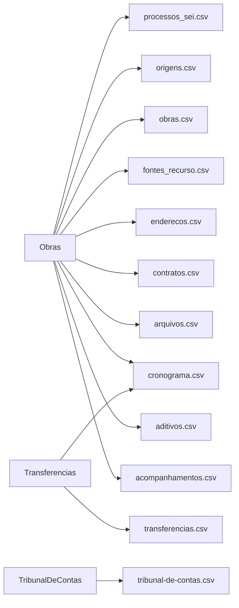

# Colunas dos relatórios

<!-- Gerado por bin/report-columns-gen.ts — não edite à mão. -->

12 arquivos de relatório com schema de colunas declarado.

## Arquivos

| Arquivo | Fontes | Colunas | Doc |
| --- | --- | --- | --- |
| `acompanhamentos.csv` | `Obras` | 18 | [detalhes](./report-columns/acompanhamentos-csv.md) |
| `aditivos.csv` | `Obras` | 10 | [detalhes](./report-columns/aditivos-csv.md) |
| `arquivos.csv` | `Obras` | 9 | [detalhes](./report-columns/arquivos-csv.md) |
| `contratos.csv` | `Obras` | 29 | [detalhes](./report-columns/contratos-csv.md) |
| `cronograma.csv` | `Obras`, `Transferencias` | 21 | [detalhes](./report-columns/cronograma-csv.md) |
| `enderecos.csv` | `Obras` | 20 | [detalhes](./report-columns/enderecos-csv.md) |
| `fontes_recurso.csv` | `Obras` | 5 | [detalhes](./report-columns/fontes-recurso-csv.md) |
| `obras.csv` | `Obras` | 74 | [detalhes](./report-columns/obras-csv.md) |
| `origens.csv` | `Obras` | 9 | [detalhes](./report-columns/origens-csv.md) |
| `processos_sei.csv` | `Obras` | 7 | [detalhes](./report-columns/processos-sei-csv.md) |
| `transferencias.csv` | `Transferencias` | 68 | [detalhes](./report-columns/transferencias-csv.md) |
| `tribunal-de-contas.csv` | `TribunalDeContas` | 13 | [detalhes](./report-columns/tribunal-de-contas-csv.md) |

## Fontes por arquivo

