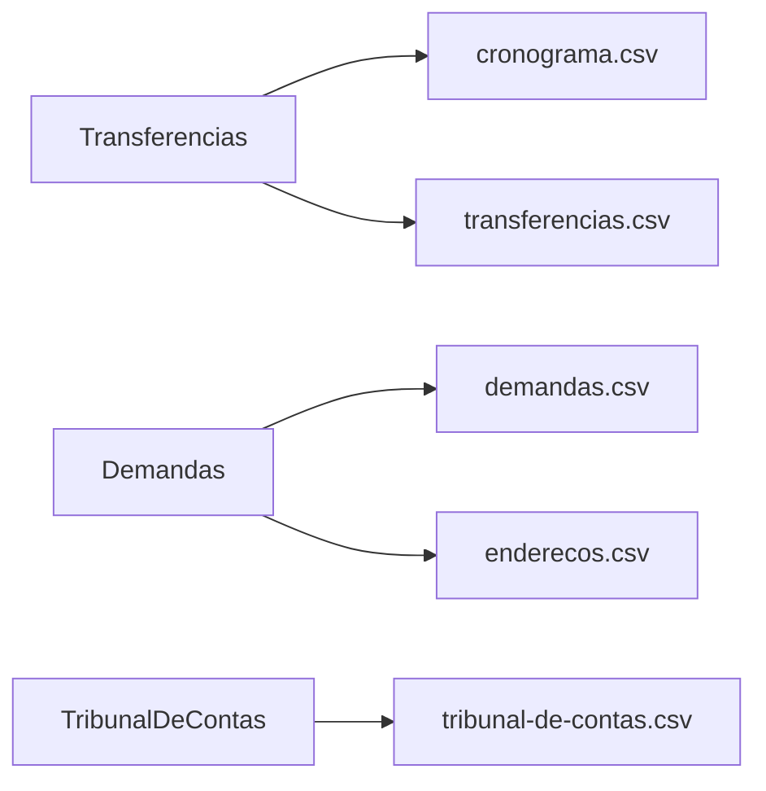

# Colunas dos relatórios

<!-- Gerado por bin/report-columns-gen.ts — não edite à mão. -->

5 arquivos de relatório com schema de colunas declarado.

## Arquivos

| Arquivo | Fontes | Colunas | Doc |
| --- | --- | --- | --- |
| `cronograma.csv` | `Transferencias` | 7 | [detalhes](./report-columns/cronograma-csv.md) |
| `demandas.csv` | `Demandas` | 18 | [detalhes](./report-columns/demandas-csv.md) |
| `enderecos.csv` | `Demandas` | 7 | [detalhes](./report-columns/enderecos-csv.md) |
| `transferencias.csv` | `Transferencias` | 68 | [detalhes](./report-columns/transferencias-csv.md) |
| `tribunal-de-contas.csv` | `TribunalDeContas` | 13 | [detalhes](./report-columns/tribunal-de-contas-csv.md) |

## Fontes por arquivo

