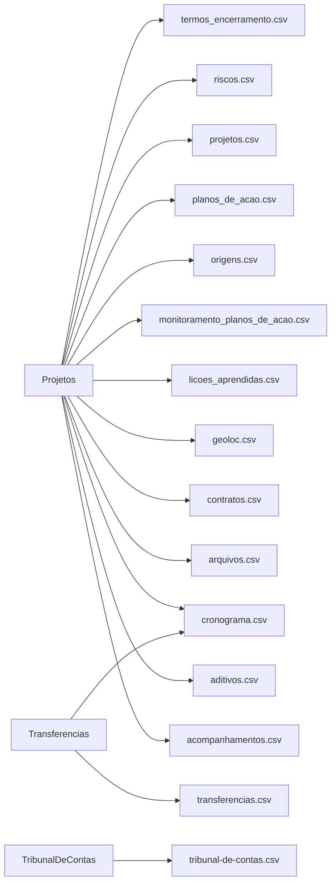

# Colunas dos relatórios

<!-- Gerado por bin/report-columns-gen.ts — não edite à mão. -->

15 arquivos de relatório com schema de colunas declarado.

## Arquivos

| Arquivo | Fontes | Colunas | Doc |
| --- | --- | --- | --- |
| `acompanhamentos.csv` | `Projetos` | 18 | [detalhes](./report-columns/acompanhamentos-csv.md) |
| `aditivos.csv` | `Projetos` | 8 | [detalhes](./report-columns/aditivos-csv.md) |
| `arquivos.csv` | `Projetos` | 9 | [detalhes](./report-columns/arquivos-csv.md) |
| `contratos.csv` | `Projetos` | 29 | [detalhes](./report-columns/contratos-csv.md) |
| `cronograma.csv` | `Projetos`, `Transferencias` | 21 | [detalhes](./report-columns/cronograma-csv.md) |
| `geoloc.csv` | `Projetos` | 20 | [detalhes](./report-columns/geoloc-csv.md) |
| `licoes_aprendidas.csv` | `Projetos` | 9 | [detalhes](./report-columns/licoes-aprendidas-csv.md) |
| `monitoramento_planos_de_acao.csv` | `Projetos` | 6 | [detalhes](./report-columns/monitoramento-planos-de-acao-csv.md) |
| `origens.csv` | `Projetos` | 9 | [detalhes](./report-columns/origens-csv.md) |
| `planos_de_acao.csv` | `Projetos` | 13 | [detalhes](./report-columns/planos-de-acao-csv.md) |
| `projetos.csv` | `Projetos` | 50 | [detalhes](./report-columns/projetos-csv.md) |
| `riscos.csv` | `Projetos` | 18 | [detalhes](./report-columns/riscos-csv.md) |
| `termos_encerramento.csv` | `Projetos` | 18 | [detalhes](./report-columns/termos-encerramento-csv.md) |
| `transferencias.csv` | `Transferencias` | 68 | [detalhes](./report-columns/transferencias-csv.md) |
| `tribunal-de-contas.csv` | `TribunalDeContas` | 13 | [detalhes](./report-columns/tribunal-de-contas-csv.md) |

## Fontes por arquivo

